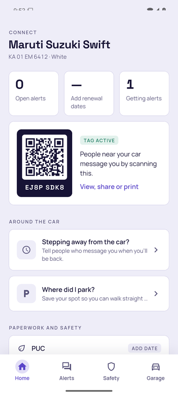
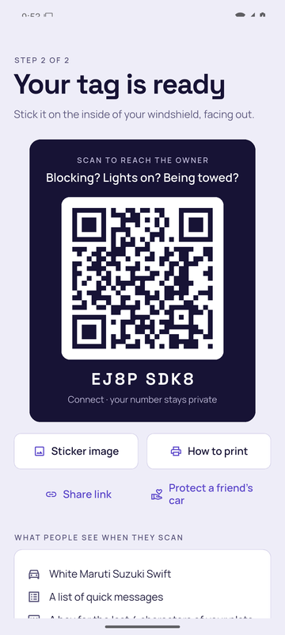
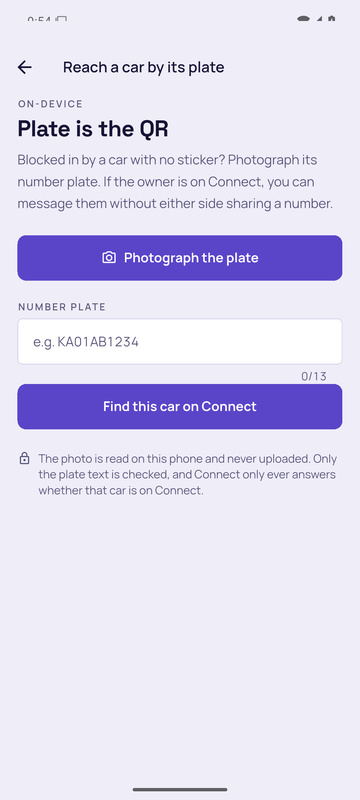
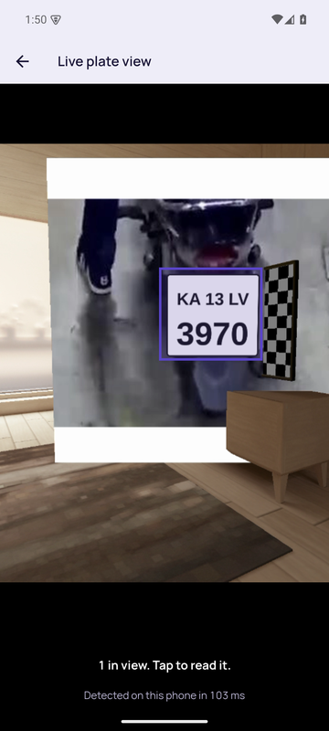
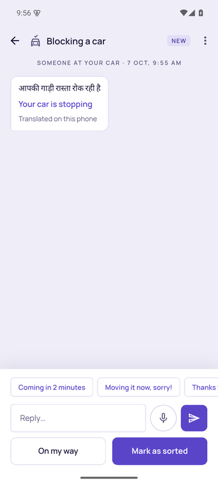

# Connect

**Anyone can reach you about your car, without either side sharing a phone number.**

A QR tag on the windshield turns "whose car is this?" into a private two-way chat. A stranger scans it with any phone camera, picks what's wrong (blocking a gate, lights on, being towed, an accident), proves they're standing at the car, and the owner and their family get the message instantly. Around that core, the app gives owners reasons to open it every week: parking, renewals, fuel and service logs, family safety and live trip sharing.

| | |
| --- | --- |
| **Platform** | Android (Flutter) + static web scan page + Supabase backend |
| **Running cost** | ₹0 / month on free tiers |
| **Languages** | English, हिन्दी, ಕನ್ನಡ, தமிழ் (app, scan page and trip page) |
| **Tests** | 139 backend end-to-end checks · 146 app tests (three of them decode real recordings of a phone's speaker) · on-device ML checks on an Android 15 emulator |


<p align="center">
  
  
  
  
  
</p>
<p align="center"><sub>Captured from the release build on an Android 15 emulator: home, the tag, plate-as-QR, the live view where our own detector boxes the plate, and an alert translated on the phone.</sub></p>

---

## What the app does

### For the person at the car (no app needed)

1. **Scan** the tag: the page shows only the car's colour, make and model.
2. **Pick a reason**: blocking a car, lights on, being towed, window open, accident or damage, or a note. Optionally attach a photo, which is shrunk in the browser.
3. **Prove you're there**: type the last 4 characters of the number plate. A shared photo of the sticker isn't enough.
4. **Chat**: quick replies or free text; if the signal drops (a basement, a lift) the page keeps your message and sends it by itself when you are back online; a line tells you when "the owner has seen your message", and after five minutes of silence the page suggests what to do next (ask nearby security or a neighbour) (set when the owner opens the thread, before any reply); see "Owner is on the way", the owner's "back by 6:30" status and, on accident reports, any medical info the owner chose to share.

### For the owner (Android app)

| Tab | What's there |
| --- | --- |
| **Home** | Alerts that need a reply, stat cards (open alerts, days to next renewal, family), the tag, "back by" status, where-did-I-park, society notices, live-trip banner |
| **Alerts** | Every conversation, photo attachments, block-and-report |
| **Safety** | Drive Mode crash detection with a 15-second cancel countdown and an on-device road scan for potholes, triple riding and riders without helmets (see [docs/road-scan.md](docs/road-scan.md)), Witness mode for a parked car, one-tap 112 and SOS to contacts, live trip sharing, medical info |
| **Garage** | Fuel and expenses with mileage, service history PDF, document photos, renewals, reach a car by its plate, say it with sound, damage check, challan check, family, society, Fit Check, tag settings, language |


**Feature details**

- **Tag**: an 8-character code printed as a QR sticker (share it as an image for a print shop), which can be paused or replaced.
- **"Back by 6:30"**: tells people who message you when you'll return. Shown only after the plate check, never from a bare scan, and it clears itself when the time passes.
- **Family sharing**: a one-time 6-character code adds up to 5 people. Everyone gets the alerts, and when someone taps "On my way" or "Sorted" the others see who ("Priya is on the way"), so two people don't both rush to the car; the person at the car is never told who; only the owner can change the plate or the tag.
- **Where did I park**: location, note, photo and a paid-parking reminder, stored only on the phone.
- **Medical info**: opt-in blood group and allergies, shown to a stranger only on an accident report.
- **Photos on alerts**: kept in a private bucket, opened through expiring links, deleted after 7 days.
- **Housing society mode**: the admin gets a join code for the notice board, member and tagged-car counts, a roster (flat and car model, never plates) and push notices.
- **Live trip sharing**: family follows a drive on a web link with the route so far. It stops by itself (1–12 h) and shows a visible notification the whole time.
- **Fuel and expenses**: full-to-full mileage, six months of spend, and a service history exported as a PDF for resale. On the phone only.
- **Documents**: photos of RC, insurance, PUC and licence, on the phone only, clearly marked as not a legal copy (that's DigiLocker).
- **Renewals**: PUC, insurance and service reminders 30 days, 7 days and on the day.
- **Challan check**: copies the plate and opens the official Parivahan e-challan site.
- **Protect a friend's car**: referral share.

### Where there is no signal

Cars get blocked in basements, and basements have no signal. Three things keep Connect useful there:

- **The app opens anyway.** The car, the tag and the alerts are kept on the phone, so the app opens on them at once and says it is offline in a strip at the top. It keeps retrying by itself. Everything that lives on the phone (the tag QR, parking, fuel log, documents, the plate reader, the damage check) works as usual.
- **Say it with sound.** Garage → *Say it with sound*: the phone says which car (its plate) and what is wrong as about two seconds of sound, inaudible first (18.0–19.7 kHz) and as audible chirps if nobody answers. Any Connect phone with that screen open answers by sound. The owner's phone shows it at once; anyone else's carries it out and delivers it when it is back online, and so does the sender's own phone. Only the plate and the reason travel through the air. The modem is ours, in plain Dart (`app/lib/services/acoustic_modem.dart`), and was measured on a real phone: see *Sound link* below.
- **The same alert lands once.** A retry after a lost reply, or two phones delivering a message they both heard, reach the owner as one alert.

### Witness mode

Safety → *Witness mode*: leave a phone on the dashboard of a parked car. Our plate detector and reader run on its camera and the last minute and a half of plates is kept in memory. When the phone feels a bump it writes down the plates in view just before and after, two frames, the time and the force. From that record you can reach the other car's owner through Connect, or save a PDF. Nothing leaves the phone. The camera only runs while the screen is on, so this is a mode for a phone left in the car, not a background service.

---

## How it works

```
stranger's phone ──► web/index.html ──► functions/v1/scan ──(service role)──► Postgres + Storage
family's browser ──► web/trip.html  ──►        │                                   │ realtime
owner's app ◄──────────────────────── REST + RLS ◄─────────────────────────────────┘
      ▲                                          │
      └──────────── FCM push ◄── _shared/push.ts ┘ (and functions/v1/notify for society notices)
```

- **Strangers never touch tables.** The `scan` edge function is their only door. It checks the plate digits, rate-limits (5 alerts per sender per 10 min, 10 per tag per hour), hashes IPs with a secret salt, and silently drops blocked senders.
- **Owners sign in anonymously** (no OTP, no form) and read or write only their own rows through row-level security. Default Supabase grants are revoked; each grant is added back explicitly, down to individual columns.
- **Information is revealed late**: "back by" only after the plate check, medical info only on accidents, trip positions only with the private link and only while the trip is live.
- **Personal logs never leave the phone**: parking, fuel and documents.

### Privacy at a glance

| A stranger can see | A stranger never sees |
| --- | --- |
| Colour, make and model | The owner's name, number or address |
| The owner's replies in their own thread | The number plate (they type 4 characters; we only say yes or no) |
| "Back by", after the plate check | Other people's alerts or messages |
| Medical info, only on an accident and only if shared | Parking spot, documents, fuel log |
| A live trip, only via the owner's link | A trip's position after it ends |

---

## Planned: on-device AI layer

Built for phone-first use, with audio and images processed on the device:

1. **The plate is the QR. (Built.)** Garage → *Reach a car by its plate*: our own plate detector (a YOLO11n we trained, 10 MB, on-device; see `ml/`) finds the plate and the on-device text reader (ML Kit) reads the crop, and if the owner is on Connect it opens the masked chat, so no sticker is needed. The photo never leaves the phone; the `plate` action only returns a tag code (and nothing when a plate is claimed by more than one account, so a squatter never receives your messages), shares the wrong-guess rate limit with plate checks, and is covered by the e2e suite. A **live camera view** (Garage → Reach a car by its plate → Live camera view) runs that detector on the camera stream at ~80–130 ms a frame (Android 15 emulator, CPU) and draws a box on every plate in view; tapping one photographs it, reads the crop and does the single lookup. Nothing is sent while you look around. The model, its training data, scores (test mAP50 0.991 on 882 held-out photos) and limits are in `ml/README.md`; it has not been scored on Indian plates.
**Our own models (see `ml/README.md` for data, scores and limits).** The plate detector is a YOLO11n we trained and fine-tuned on Indian close-ups (mAP50 0.73 on 47 real Indian phone photos, INT8, 4.3 MB); our own plate reader (CRNN, 3.4 MB) gets 60.7% of 150 held-out real Indian plates exactly right against 49.3% for ML Kit with the same repair rules (the app tries ours first and shows both as chips; the right plate is among them 73% of the time). End to end on 44 real Indian phone photos, merging whole-photo ML Kit with the detector-and-reader path finds 28 of 46 plates with the right one first on 25 photos, against 22 and 21 for whole-photo ML Kit alone (hand-labelled, small, see `ml/README.md`). A **damage check** (Garage → Check damage and cost, and an "Estimate damage" button on a photo a stranger sent) finds dents, scratches, cracks and shattered glass with a model trained by us (YOLO11s, INT8, mAP50 0.40, honest and modest; only four classes are reliable) and gives a rough ₹ repair range from a hand-set table, plus an evidence PDF. The range is an assumption-based estimate, never a quote.

2. **Situation understanding. (Built, deliberately conservative.)** After finding a car by plate, a photo of the problem is labelled on-device (ML Kit). ML Kit's base model labels every car photo "Vehicle, Car, Wheel, Road, Bumper…", so generic parts prove nothing; a suggestion (reason, drafted message, urgency flag) appears only on distinctive signs such as a wreck, a tow truck or a gate in frame, and otherwise the person picks the reason. Measured on a real car photo on an emulator: no suggestion. The suggestion rides to the scan page in the URL fragment (never sent to a server) and the sender still reviews and sends it.
**Sound link (measured on a phone).** `app/tool/sound_lab.dart` is a separate lab build that plays test signals on a phone's speaker while recording its microphone. On an iQOO 15 the speaker-to-microphone path is flat from 17 to 19.25 kHz and falls away above 19.5 kHz, which is why the silent band sits at 18.0–19.7 kHz. Frames the phone played were decoded from a laptop microphone on the same desk: 12 of 12 at full volume and 20 dB quieter, 6 of 8 at 40 dB quieter (a tone landing in a dead spot between the two devices loses a frame, so a send is tried three times). Three of those recordings are test fixtures (`app/test/fixtures`). The app's own sound link, run against itself on a second iQOO 15, heard every frame it sent on both bands, and the laptop microphone decoded all six as well. Two phones answering each other live has not been run yet. Two things only a real phone showed: the recorder stops when the player takes audio focus unless told not to, and voice processing has to be off.

3. **Language bridge. (Built.)** In an alert thread, a stranger's message has a *Translate* action: the language is detected and translated into the app's language by ML Kit models on the phone (a ~30 MB pack per language downloads once). The owner can also dictate a reply with the phone's speech recogniser. Going the other way, the scan page sends the stranger's chosen language with the alert, and the owner's quick replies are sent in that language from the app's own translation tables (no machine translation), so a Kannada speaker gets "2 ನಿಮಿಷದಲ್ಲಿ ಬರುತ್ತೇನೆ" even when the owner's app is in English. Free-text replies, typed or spoken, are translated into the stranger's language on the phone too, with a preview ("They will read: …" next to what you wrote) before anything is sent; verified on an Android 15 emulator. Voice notes from the *stranger* are not handled, since the scan page has no on-device model.

## Repository

```
app/          Flutter app (Android first)
  lib/data/       AppState (all server calls), models, car catalog
  lib/screens/    24 screen files
  lib/services/   notifications, push, parking, garage log, wallet, trip share, PDF, crash detector
  lib/widgets/    shared components + motion primitives
  lib/l10n.dart   tr() and language switching; translations in assets/l10n/*.json
web/          Scan page (index.html) and live-trip viewer (trip.html): static, 4 languages
supabase/
  migrations/     schema, RLS, grants, RPCs
  functions/      scan (strangers' API), notify (society push), _shared/push.ts (FCM)
  tests/e2e.mjs   139 black-box checks against a running stack
scripts/      demo-up.sh: the stack, the functions, the scan page and the tunnel in one command
docs/         Feature inventory, demo runbook, roadmap notes
```

## Run it in Docker (for friends, or when the laptop breaks)

Needs only Docker with the compose plugin (Linux or WSL2). One command starts the whole backend:

```bash
git clone https://github.com/nikhilcherry/connect && cd connect
./connect up        # first run pulls ~2 GB of images; later runs take seconds
./connect status    # what is up, with the URLs
./connect down      # stop everything (data kept);  ./connect reset  wipes the demo data
```

| Service | URL | What it is |
|---|---|---|
| backend | `http://localhost:54321` (Studio `:54323`) | Supabase (db, auth, storage, realtime) with this repo's migrations, plus the edge functions `scan`, `notify`, `rc-lookup`, `vehicle-vision` |
| scanpage | `http://localhost:8093/t/<TAG>` | the page a stranger opens from a car's QR code |
| n8n | `http://localhost:5678` | the two "how it works" workflows, already imported and published: `POST /webhook/connect-alert` (Jev + a cheap model triage a stranger's note) `POST /webhook/connect-whisper` (the Bluetooth store-carry-forward relay) and `POST /webhook/traffic-violation` (the road-scan report dispatcher: AI reads the photo, Jev rates severity, the right station is emailed; it needs a Gmail account connected in n8n) |

`./connect up` creates `.env` from `.env.example`. For the n8n demo add `JEV_API_KEY` (TypeSafe) and `OPENROUTER_API_KEY`; without them the backend and scan page still work. Build the app against your machine with `--dart-define=SUPABASE_URL=http://<your-LAN-IP>:54321 --dart-define=SUPABASE_ANON_KEY=sb_publishable_ACJWlzQHlZjBrEguHvfOxg_3BJgxAaH --dart-define=SCAN_BASE_URL=http://<your-LAN-IP>:8093` (leave out the anon key and the app uses the hosted project's key: the data calls still work but the live alert socket is rejected, so alerts only show after a restart), and set `CONNECT_API_URL` in `.env` to the same API address so the scan page talks to it. `./connect up --tunnel` also starts a Cloudflare tunnel when `TUNNEL_TOKEN` is set. If a default port is taken, change `SCAN_PORT` / `N8N_PORT` in `.env`; the Supabase ports come from `supabase/config.toml`.

## Run locally

Needs Docker, the Supabase CLI, Node 20+ and Flutter 3.44; JDK 17 for Android builds.

```bash
# 1. Backend
supabase start && supabase db reset
supabase functions serve --no-verify-jwt --env-file supabase/functions/.env.local

# 2. Backend tests: privacy/RLS, blocking, lockout, family, photos, medical, society, trips
node supabase/tests/e2e.mjs

# 3. Scan and trip pages on :8093 (serves config.local.js when present)
python3 web/serve.py                       # /t/<TAG CODE> and /trip#<TOKEN>

# 4. App (on-device ML checks need an emulator/phone: adb push app/integration_test/assets/plate.png /data/local/tmp/ && flutter test integration_test -d <device>)
cd app && flutter test
flutter run -d chrome --dart-define=SCAN_BASE_URL=http://127.0.0.1:8093   # quickest UI loop
flutter build apk --debug                                                # emulator reaches the host at 10.0.2.2
```

`supabase/functions/.env.local` sets `SCAN_IP_HOP=first`, which trusts the client-sent IP so the tests can simulate many senders. **Never use it in production.**

### Demo backend on a laptop

For a demo with real phones and no hosted project, the stack on a laptop can stand in for one behind a tunnel:

```bash
scripts/demo-up.sh            # starts what is not running: stack, functions, scan page on :8093; then checks each
scripts/demo-up.sh --watch    # the same, then stays up and restarts the tunnel when it drops
scripts/demo-up.sh --publish  # also puts the scan page on a public address through the tunnel

cd app && flutter build apk --release --target-platform android-arm64 \
  --dart-define=SUPABASE_URL=https://connect-api.premortem.tech \
  --dart-define=SCAN_BASE_URL=https://connect.premortem.tech
```

Nothing restarts by itself after a reboot, and the tunnel can die without noticing when the laptop's route changes (a phone starting USB tethering does it), so leave `--watch` running. Take both addresses down afterwards with `hoist down connect-api connect`: the database behind them is a development stack.

## Configure your own backend

The repo ships with placeholders, not a live backend:

- `web/config.js`: set `supabaseUrl` and `anonKey` (the publishable key is public by design).
- `app/lib/config.dart`: `scanBaseUrl` and `appUrl` default to `connect.premortem.tech`; pass `--dart-define=SCAN_BASE_URL=...` or change the defaults to your domain. Printed QR stickers can't be changed, so pick the domain before printing.

```bash
supabase link --project-ref <your-project-ref>
supabase secrets set SCAN_IP_SALT=$(openssl rand -hex 32)   # without it `scan` returns 503
supabase db push
supabase functions deploy scan notify --no-verify-jwt
# host web/ on Vercel (rewrites in web/vercel.json)

# --split-per-abi: arm64 is ~68 MB; one fat APK is ~180 MB because of ML Kit
cd app && flutter build apk --release --split-per-abi \
  --dart-define=SUPABASE_URL=https://<your-project-ref>.supabase.co \
  --dart-define=SUPABASE_ANON_KEY=<publishable key> \
  --dart-define=SCAN_BASE_URL=https://<your-domain>
```

Push is optional: create a Firebase project with Android app `app.connectcar.connect`, add the four `FIREBASE_*` dart-defines, and `supabase secrets set FCM_SERVICE_ACCOUNT="$(cat key.json)"`.

## Known gaps

- **Push isn't switched on** until a Firebase project exists; until then alerts only notify while the app process is alive.
- **SOS opens the SMS app pre-filled** and can't send silently: Play only grants SEND_SMS to default SMS apps.
- **Crash detection runs only while Drive Mode is on screen** (4 g threshold, 15 s countdown, not validated against real crashes).
- **Accounts live on one phone**: reinstalling loses the car. Adding the car again leaves its plate claimed by two accounts, and the plate lookup then refuses it.
- **Sound needs the screen open**: a phone hears messages sent by sound only while *Say it with sound* is on screen, and Witness mode only watches while its screen is on.
- **The RC check when adding a car is a demo**: generated data and a simulated comparison, until an RC provider is connected.
- Several cars per account: switch from the chips at the top of Garage. Alerts are account-wide, and local logs (parking, fuel, documents) are shared across cars.
- **Translations** have not had a native-speaker review.
- Car dimensions are typical figures for 39 popular models, shown as editable estimates.
- Account deletion (Garage → Delete my account) and a privacy page (`web/privacy.html`, served at `/privacy`) exist.
